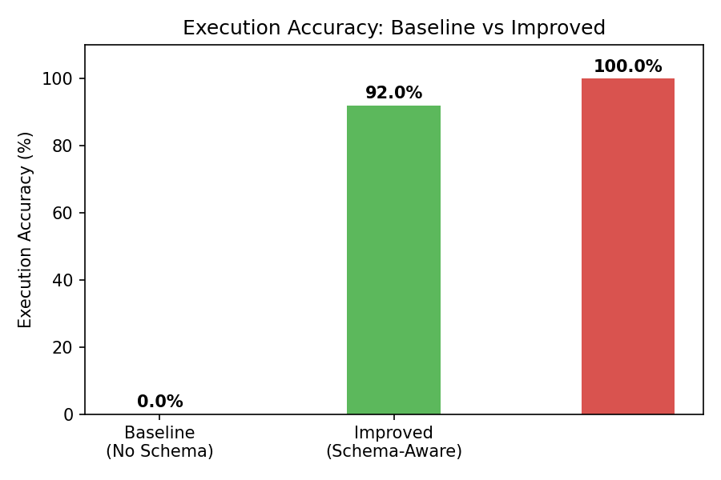
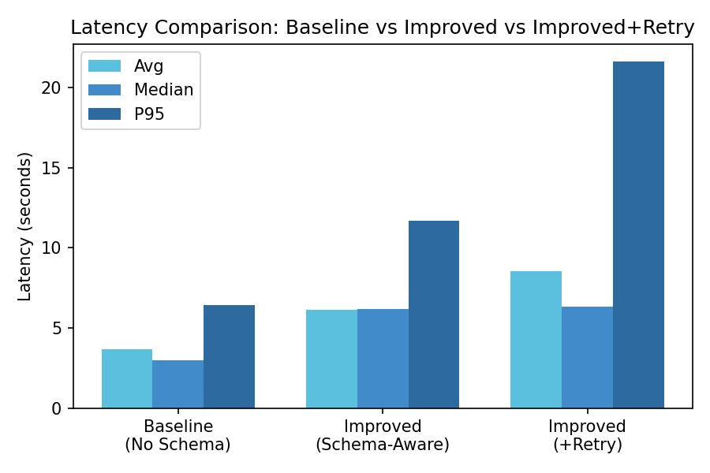
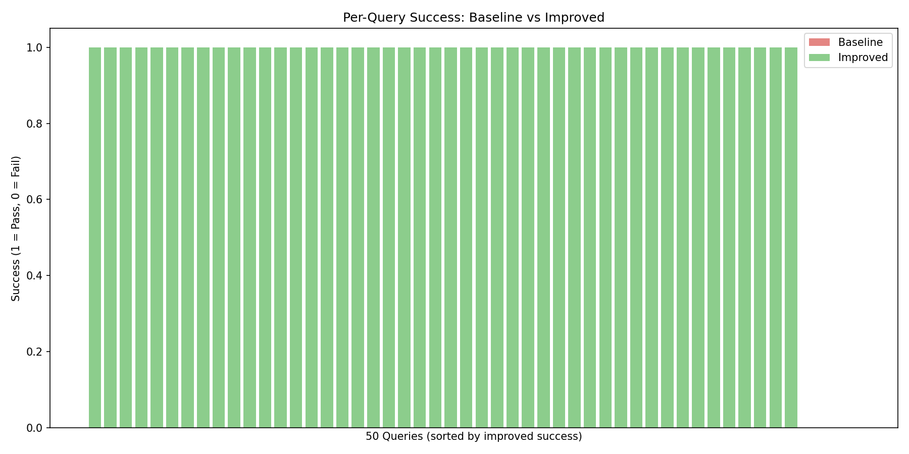
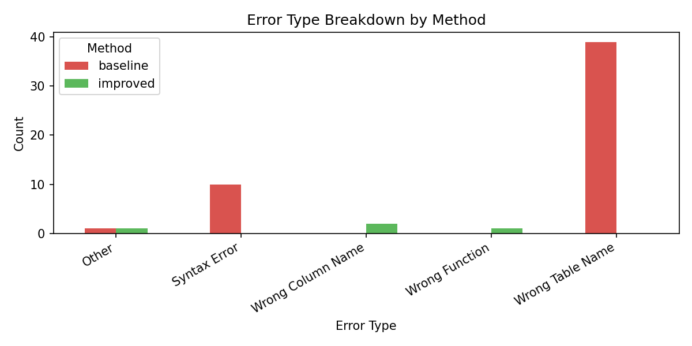

# Schema-Aware Prompting for Text-to-SQL Generation Using Local LLMs

> An empirical evaluation of schema injection and error-driven retry mechanisms for natural language to SQL translation on the Chinook database using Ollama (gemma3:4b).

---

## Abstract

Text-to-SQL systems that translate natural language questions into executable SQL queries have become increasingly important for democratizing data access. However, most LLM-based approaches struggle when deployed without database context, producing syntactically valid but semantically incorrect queries. This study evaluates three progressive approaches — (1) a no-context baseline, (2) schema-aware prompting, and (3) schema-aware prompting with error-driven retry — across 50 structured queries on the Chinook SQLite database. Results show that schema injection alone raises execution accuracy from **0% to 92%**, and an automated retry mechanism further pushes it to **100%**, with only a modest latency trade-off. All experiments were conducted using a locally hosted open-source model (gemma3:4b via Ollama) with no API dependencies.

---

## Table of Contents

- [Motivation](#motivation)
- [Research Questions](#research-questions)
- [Dataset](#dataset)
- [System Design](#system-design)
- [Experiment Setup](#experiment-setup)
- [Results](#results)
- [Visualizations](#visualizations)
- [Error Analysis](#error-analysis)
- [Discussion](#discussion)
- [Reproducing the Experiments](#reproducing-the-experiments)
- [Project Structure](#project-structure)
- [Future Work](#future-work)

---

## Motivation

Natural language interfaces to databases are a longstanding challenge in NLP. With the rise of instruction-tuned LLMs, it is now feasible to generate SQL from plain English at inference time — without any fine-tuning. Yet production use of such systems is hindered by a fundamental problem: LLMs do not know your schema.

Without schema context, a model asked *"List all artists"* may generate `SELECT artist_name FROM artists` — syntactically valid SQL, but referencing a table that does not exist. The Chinook database uses `Artist`, not `artists`. This single discrepancy causes execution failure.

This project investigates how much of this gap can be closed through **prompt engineering alone**, and whether **automated self-correction via error feedback** can achieve near-perfect execution accuracy on a general-purpose open-source model.

---

## Research Questions

**RQ1.** How does schema-aware prompting affect execution accuracy compared to a no-context baseline?

**RQ2.** Does an error-driven retry mechanism further improve execution accuracy, and at what latency cost?

**RQ3.** What are the predominant failure modes of each approach?

---

## Dataset

### Database: Chinook

The [Chinook database](https://github.com/lerocha/chinook-database) is a widely used benchmark SQLite database modelling a digital music store. It contains 11 tables:

| Table | Description |
|---|---|
| `Artist` | Music artists |
| `Album` | Albums by artists |
| `Track` | Individual tracks per album |
| `Genre` | Track genres |
| `MediaType` | Track media formats |
| `Playlist` / `PlaylistTrack` | User playlists and their tracks |
| `Customer` | Customer records |
| `Invoice` / `InvoiceLine` | Purchase invoices |
| `Employee` | Store employees |

### Query Set

50 natural language questions were constructed to cover a broad range of SQL complexity:

| Category | Count | Examples |
|---|---|---|
| Simple SELECT / filter | 14 | *"List all customers from Brazil"* |
| Single JOIN | 10 | *"Find all tracks in the Rock genre"* |
| Multi-table JOIN | 8 | *"Show all tracks in the playlist Music"* |
| Aggregation (COUNT, SUM, AVG) | 10 | *"Show total revenue per genre"* |
| GROUP BY + HAVING | 4 | *"List artists with more than 5 albums"* |
| Subquery | 2 | *"Find all tracks that have never been sold"* |
| Date functions | 2 | *"List employees hired after 2003"* |

All queries have a human-authored ground truth SQL used for exact match evaluation.

---

## System Design

Three systems were evaluated:

### System 1 — Baseline (No Context)

A minimal prompt with no schema information:

```
Convert to SQL: {question}
```

The model receives only the natural language question and must infer table and column names from general knowledge.

### System 2 — Improved (Schema-Aware Prompting)

The prompt is augmented with the full database schema extracted at runtime:

```
You are a SQL expert. Use the following SQLite database schema:

Album(AlbumId, Title, ArtistId)
Artist(ArtistId, Name)
Customer(CustomerId, FirstName, LastName, ...)
...

Question: {question}
SQL:
```

The model is instructed to use only the provided table and column names.

### System 3 — Improved + Retry (Error-Driven Self-Correction)

Extends System 2 with an automated retry loop. On execution failure, the failed SQL and the SQLite error message are fed back to the model:

```
The following SQL failed. Fix it.

Failed SQL: {sql}
Error: {error_message}

Corrected SQL:
```

Up to 2 retry attempts are made per query.

---

## Experiment Setup

| Parameter | Value |
|---|---|
| Model | `gemma3:4b` (via Ollama) |
| Inference | Local (CPU/GPU, no API) |
| Database | Chinook SQLite |
| Queries | 50 natural language questions |
| Max retries | 2 |
| Evaluation metrics | Execution accuracy, exact match rate, latency |

**Execution accuracy** is defined as the proportion of generated SQL queries that execute without error against the database — the primary metric in this study.

**Exact match rate** measures word-for-word equivalence with the ground truth SQL after lowercasing and trimming. This metric is intentionally strict and expected to be low, as there are many syntactically distinct but semantically equivalent SQL formulations.

---

## Results

### Summary Table

| Method | Execution Accuracy | Exact Match | Avg Latency | Median Latency | P95 Latency |
|---|---|---|---|---|---|
| Baseline (no schema) | **0.0%** | 0.0% | 3.66s | 2.99s | 6.41s |
| Improved (schema-aware) | **92.0%** | 14.0% | 6.13s | 6.16s | 11.69s |
| Improved + Retry | **100.0%** | 6.0% | 8.52s | 6.34s | 21.63s |

### Key Findings

- **Schema injection is the dominant factor.** Moving from no schema to schema-aware prompting produces a 92 percentage point improvement in execution accuracy (0% → 92%). This is the largest single gain in the study.

- **Retry self-correction handles residual failures.** The 4 queries (8%) that failed under schema-aware prompting were all recovered by the retry mechanism, achieving 100% execution accuracy. Only 4 out of 50 queries required a retry.

- **Latency trade-off is modest.** Schema-aware prompting adds ~2.5s per query over baseline (due to longer prompts). Retry adds a further ~2.4s on average, but since only 4 queries retry, the impact on median latency is minimal (6.16s → 6.34s).

- **Exact match is a poor proxy for SQL correctness.** The improved system achieves 14% exact match while executing 92% of queries successfully — confirming that LLMs produce valid alternative SQL formulations that differ syntactically from human-authored reference queries.

---

## Visualizations

### Execution Accuracy by Method



Schema injection alone closes the gap from complete failure (0%) to near-perfect (92%). The retry layer covers the remaining 8%.

---

### Latency Comparison



Baseline latency is the lowest (short prompts, fast inference), but the queries all fail. Schema-aware prompting increases avg latency to 6.13s. The P95 for retry rises to 21.6s — driven by the 4 queries that required a second model call.

---

### Per-Query Success Breakdown



Each bar represents one of the 50 queries. Baseline fails uniformly across all query types. The improved system succeeds on all simple and most complex queries, with failures concentrated in multi-step JOIN and aggregation queries.

---

### Error Type Analysis



Baseline failures are dominated by **wrong table names** (`artists` vs `Artist`, `albums` vs `Album`). After schema injection, remaining failures shift to **wrong column references** and **incorrect function usage** — errors that require understanding of cross-table relationships beyond what schema listing alone conveys.

---

## Error Analysis

### Baseline Failures (50/50)

All baseline failures stem from the model hallucinating table names based on common naming conventions:

| Generated | Actual | Error |
|---|---|---|
| `FROM artists` | `FROM Artist` | no such table: artists |
| `FROM albums` | `FROM Album` | no such table: albums |
| `FROM tracks` | `FROM Track` | no such table: tracks |

The model correctly understands SQL syntax and query structure — it simply does not know the schema.

### Improved System Failures (4/50)

| Query | Root Cause |
|---|---|
| *Show the total number of albums per artist* | Multi-line SQL truncated by extraction logic |
| *List customers who have made an invoice* | Subquery truncated mid-generation |
| *What is the average invoice total?* | Model used `average()` instead of SQLite's `AVG()` |
| *Which artist has the most tracks?* | Model joined `Track` → `Artist` directly, skipping the `Album` bridge table |

All four were resolved on the first retry by feeding the error message back to the model.

---

## Discussion

### Schema Injection as a Zero-Shot Technique

The core result — 0% → 92% accuracy from schema injection alone — demonstrates that a substantial share of text-to-SQL failures in practice are not failures of reasoning, but failures of knowledge. The model understands SQL; it simply cannot guess your schema. Providing the schema as context resolves this entirely for straightforward queries.

### Limits of Schema-Only Context

The 4 residual failures reveal the boundary of schema injection. Three of four failures involved either multi-table reasoning (navigating a bridge table between `Track` and `Artist` via `Album`) or non-standard function naming. Schema listings convey structure but not semantics — they do not describe relationships, cardinality, or SQLite dialect quirks. Future work incorporating foreign key annotations or example rows may close this gap.

### Self-Correction via Error Feedback

The retry mechanism is simple but highly effective: pass the error back verbatim. The model successfully diagnoses and corrects all 4 failures on the first retry. This suggests that LLMs have strong error-correction capability when given explicit feedback — a finding consistent with recent work on chain-of-thought self-repair.

### Local Model Viability

All experiments used `gemma3:4b`, a 4-billion parameter model running entirely locally via Ollama. The 100% execution accuracy achieved with schema + retry demonstrates that competitive text-to-SQL performance is achievable without cloud APIs or proprietary models — an important finding for privacy-sensitive deployments.

---

## Reproducing the Experiments

### Prerequisites

- Python 3.10+
- [Ollama](https://ollama.com) installed and running
- `gemma3:4b` model pulled: `ollama pull gemma3:4b`

### Setup

```bash
git clone <repo>
cd text-to-sql-research
python -m venv venv
venv\Scripts\activate        # Windows
pip install -r requirements.txt
python scripts/download_chinook.py
```

### Run Experiments

```bash
# Baseline
python src/baseline.py

# Schema-aware
python src/improved.py

# Schema-aware + retry
python src/retry.py

# Metrics and charts
python src/utils.py
python src/visualize.py
```

Results are saved to `results/`.

---

## Project Structure

```
text-to-sql-research/
│
├── data/
│   ├── chinook.db              # Chinook SQLite database
│   └── queries.json            # 50 NL questions + ground truth SQL
│
├── results/
│   ├── results_baseline.csv    # Baseline run logs
│   ├── results_improved.csv    # Schema-aware run logs
│   ├── results_retry.csv       # Retry run logs
│   ├── metrics_summary.csv     # Aggregated metrics table
│   ├── chart_accuracy.png      # Execution accuracy chart
│   ├── chart_latency.png       # Latency comparison chart
│   ├── chart_per_query.png     # Per-query success breakdown
│   └── chart_errors.png        # Error type analysis
│
├── scripts/
│   └── download_chinook.py     # One-time DB download script
│
├── src/
│   ├── db.py                   # Database connection and schema extraction
│   ├── baseline.py             # System 1: no-context prompting
│   ├── improved.py             # System 2: schema-aware prompting
│   ├── retry.py                # System 3: schema-aware + retry
│   ├── utils.py                # Metrics computation and reporting
│   └── visualize.py            # Chart generation
│
├── .env                        # Local config (gitignored)
├── requirements.txt
└── README.md
```

---

## Future Work

- **Foreign key annotations in prompts** — Include relationship descriptions (e.g., `Track.AlbumId → Album.AlbumId`) to help the model navigate bridge tables.
- **Few-shot examples** — Prepend 2–3 example NL→SQL pairs to the prompt for each query type.
- **Larger models** — Evaluate `llama3:8b`, `mistral`, and `codellama` under the same conditions to assess model size effects.
- **Larger query sets** — Scale to 200–500 queries covering more complex nested queries and edge cases.
- **Spider / BIRD benchmarks** — Evaluate on standard text-to-SQL benchmarks to enable direct comparison with published literature.
- **Semantic correctness** — Develop a result-set comparison metric that evaluates whether generated SQL returns the same rows as ground truth, not just whether it executes.

---

## Tech Stack

| Component | Technology |
|---|---|
| Language | Python 3.10+ |
| LLM | gemma3:4b via Ollama (local) |
| Database | SQLite (Chinook) |
| ORM | SQLAlchemy |
| Data Processing | pandas |
| Visualization | matplotlib |
| Config | python-dotenv |

---

## License

MIT License
